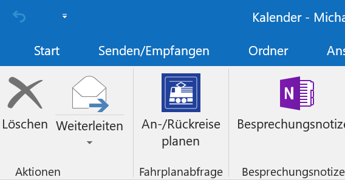
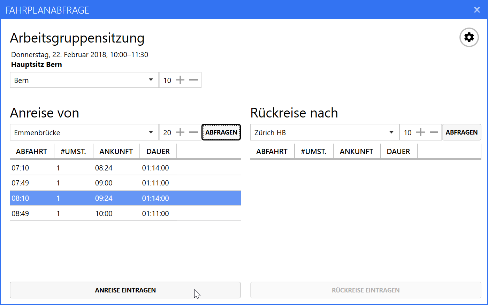
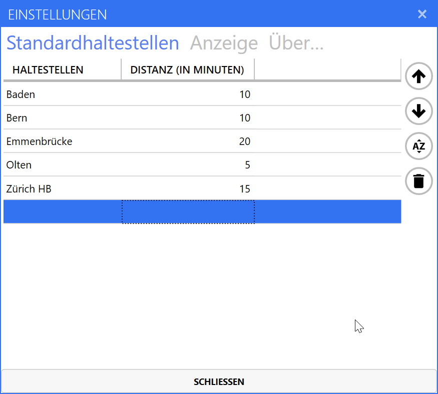

# OutlookSwissPTTimetable
Swiss public transport timetable add-in for Microsoft Outlook

## So funktioniert die Fahrplanabfrage für Microsoft Outlook

Möchten Sie die Reise mit öffentlichen Verkehrsmitteln zu ihren Terminen direkt in Microsoft Outlook planen? So geht’s:

1. Laden Sie das Installationsprogramm [von hier](https://timetable.mbeer.ch/setup.exe) herunter und führen Sie es aus.  
**[Achtung: Da das Installationsprogramm erst mit einem temporären Zertifikat digital signiert ist, kommt es bei der Installation unter Umständen zu Fehlermeldungen. An einer Lösung wird gearbeitet.]**
1. Starten Sie Microsoft Outlook neu.
1. Selektieren Sie in Ihrem Kalender den Termin, für den Sie die An- und Rückreise planen möchten.
1. Klicken Sie im Menüband auf den Befehl «An-/Rückreise planen»  
    
1. Wählen Sie nun im sich öffnenden Dialogfenster
    1. die nächstgelegene Haltestelle zum Besprechungsort
	1. die Haltestelle, von der aus Sie anreisen
	1. die Haltestelle, zu der Sie zurückreisen
	1. für jede der Haltestellen die Zeit in Minuten, die Sie für den Übergang benötigen  
        
1. Klicken Sie sowohl für die Anreise als auch für die Rückreise auf «Abfragen», um die passenden Verbindungen anzuzeigen.
1. Wählen Sie die gewünschten Verbindungen in der Liste aus und klicken Sie auf «Anreise eintragen» bzw. «Rückreise eintragen», um ein entsprechendes Kalenderelement anzulegen.

In den Programmeinstellungen lassen sich die am häufigsten genutzten Haltestellen (samt den zugehörigen Distanzen) festlegen, um sie bei der Verwendung des Add-ins aus der Auswahlliste wählen zu können.

## Fahrplandaten

OutlookSwissPTTimetable bezieht die Fahrplandaten über die [Swiss public transport API](https://transport.opendata.ch/), powered by [Opendata.ch](https://opendata.ch/).

## Erstellt mit

* [Microsoft Visual Studio Community 2017](https://www.visualstudio.com/de/vs/)
* [Json.NET](https://www.newtonsoft.com/json)
* [Mahapps.Metro](https://github.com/MahApps/MahApps.Metro) und [Mahapps.Metro.IconPacks](https://github.com/MahApps/MahApps.Metro.IconPacks)

## Autor

Michael Beer – Github: [mbeer](https://github.com/mbeer/), Web: [michael.beer.name](http://www.michael.beer.name)

Siehe auch die Liste der [Mitwirkenden](https://github.com/mbeer/OutlookSwissPTTimetable/contributors) in diesem Projekt.

## Lizenz

Dieses Projekt wird unter der [MIT-Lizenz](https://de.wikipedia.org/wiki/MIT-Lizenz) veröffentlicht – siehe die Datei [LICENSE](LICENSE).

